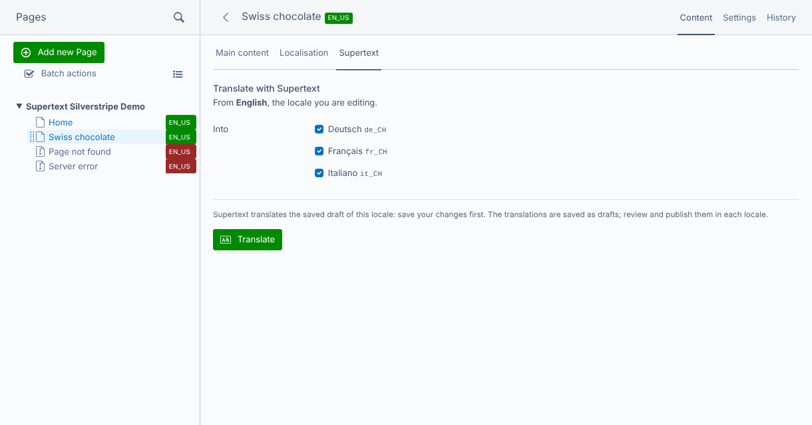

# Supertext Translation for Silverstripe

Translate Silverstripe pages into your other Fluent locales with **Supertext AI**, right in the CMS.

Open a page, go to the **Supertext** tab, tick the locales and click **Translate**: the page name, navigation label, meta description, content and the page's Elemental blocks go to Supertext in one request per locale and come back as a draft of the page in each locale. Editors review, adjust and publish as usual.

- Uses Fluent's own locales and its rules for which fields are localised
- HTML keeps its headings, bold text, links and lists; whole texts are translated in context
- Elemental blocks (localised with Fluent) are translated with the page
- Translated URL segments for new locales
- Locales with their own content are kept unless the editor explicitly overwrites them
- Formal or informal tone and custom Supertext language codes per locale, in the Locales admin
- A Supertext section with *Test connection* and a translation log; tasks for scripts



## Documentation

| Guide | For |
| --- | --- |
| [Installation guide](docs/INSTALLATION.md) | Administrators: requirements, install, API key, locales, permissions, settings, troubleshooting |
| [User guide](docs/USER_GUIDE.md) | Editors: translating, reviewing, overwriting, what gets translated |
| [Developer guide](docs/DEVELOPER.md) | Architecture, API protocol, local development, tests, demo deployment, releases |

Quick start:

```bash
composer config repositories.supertext vcs https://github.com/Supertext/Silverstripe-Supertext-Translation
composer require supertext/silverstripe-supertext-translation:dev-main
vendor/bin/sake db:build --flush
# .env: SUPERTEXT_API_KEY="…"
```

## Demo

`demo/` is a Silverstripe 6 site with Fluent and Elemental, an English sample page and German, French and Italian (Switzerland) locales, deployed to Railway from this repository. See the [developer guide](docs/DEVELOPER.md#demo-railway).

Part of Supertext's translation plugins for open source CMSs, alongside the plugins for [WordPress](https://github.com/Supertext/supertext-wordpress-polylang), [Drupal](https://www.drupal.org/project/tmgmt_supertext_ai), [Craft CMS](https://github.com/Supertext/CraftCms-Supertext-Translation), [TYPO3](https://github.com/Supertext/TYPO3-Supertext-Translation) and others.

## Changelog and roadmap

See [CHANGELOG.md](CHANGELOG.md) and the [roadmap](docs/DEVELOPER.md#known-limitations--roadmap).

## License

MIT. © Supertext AG
