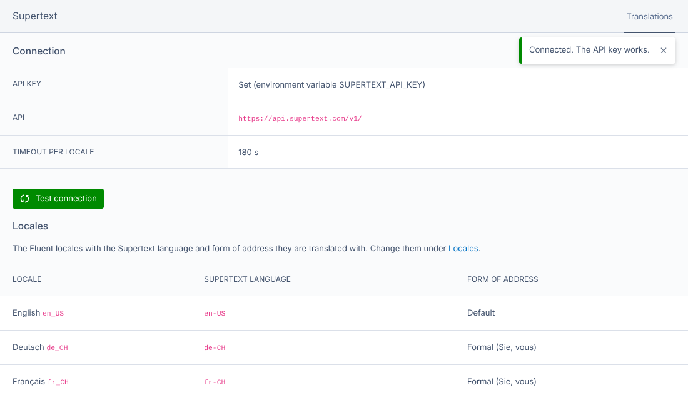
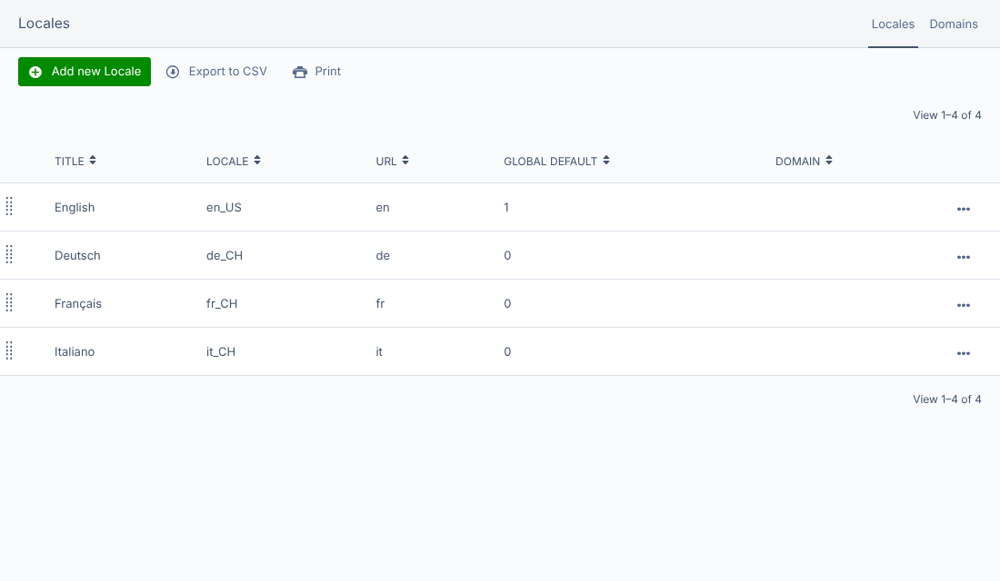
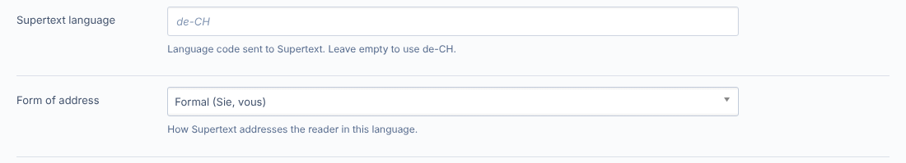

# Installation guide — Supertext Translation for Silverstripe

For administrators and developers who install and set up the module. Editors find their part in the [user guide](USER_GUIDE.md).

## Requirements

- Silverstripe CMS 6 (tested with 6.2), PHP 8.3 or later
- [Fluent](https://github.com/tractorcow-farm/silverstripe-fluent) 8 with at least two locales
- Optional: [Elemental](https://github.com/silverstripe/silverstripe-elemental) 6, with blocks localised directly by Fluent (see [Elemental blocks](#elemental-blocks))
- A Supertext account with an API key (Supertext → Account → API)
- The server must reach `https://api.supertext.com` over HTTPS

## Install

```bash
composer config repositories.supertext vcs https://github.com/Supertext/Silverstripe-Supertext-Translation
composer require supertext/silverstripe-supertext-translation:dev-main
vendor/bin/sake db:build --flush
```

(Publishing to Packagist is planned; then the first line is no longer needed.)

`db:build` adds the table `SupertextTranslation` (the translation log) and two fields to Fluent's locales. The module adds:

- a **Supertext** tab to every page in the CMS (for users with the Supertext permission),
- a **Supertext** section in the CMS menu: connection status, *Test connection* (administrators), the locales and the translation log,
- *Supertext language* and *Form of address* to each locale under **Locales**,
- the tasks `supertext-translate` and `supertext-check`.

### Update

```bash
composer update supertext/silverstripe-supertext-translation
vendor/bin/sake db:build --flush
```

See [CHANGELOG.md](../CHANGELOG.md).

### Uninstall

```bash
composer remove supertext/silverstripe-supertext-translation
vendor/bin/sake db:build --flush
```

Translations already made are normal Fluent content and stay. The table `SupertextTranslation` and the columns `SupertextCode` and `SupertextPoliteness` of `Fluent_Locale` are left in the database (Silverstripe never drops them); delete them by hand if you like.

## API key

Set the key as an environment variable, in `.env` or in your hosting's settings:

```bash
SUPERTEXT_API_KEY="your-key"
```

You can paste it with or without the `Supertext-Auth-Key ` prefix that Supertext shows. The module sends it as `Authorization: Supertext-Auth-Key <key>`. Keep the key out of your repository.

Check it under **Supertext → Test connection** (administrators) or with `vendor/bin/sake tasks:supertext-check`. Both call a cost-free endpoint of the Supertext API.



## Locales

The module translates between your Fluent locales (**Locales** in the CMS menu). Each locale is sent to Supertext in BCP-47 form (`de_CH` → `de-CH`). Use regional locales where they matter: `de_CH` writes "ss" instead of "ß".



Open a locale to set its two Supertext fields:

- **Supertext language**: a different code to send to Supertext (e.g. `fr-CH` for a locale `fr_FR` used for Swiss readers). Empty means the locale's own code.
- **Form of address**: *Formal (Sie, vous)*, *Informal (du, tu)* or *Default*.



## Permissions

Under **Security → Groups → Permissions**, give editors:

- **Translate content with Supertext** (`SUPERTEXT_TRANSLATE`, category *Supertext*): shows the Supertext tab and the Supertext section.
- Access to **Pages** and the right to edit the pages, as usual.

The module checks that the user may edit the page **in each target locale**. If you restrict groups to certain locales with Fluent's *Access "Deutsch" (de_CH)* permissions, editors can only translate into the locales their groups cover. *Test connection* is for administrators.

## Settings

All settings are optional and live in YAML:

```yaml
Supertext\Silverstripe\Supertext:
  environment: live          # live | staging | testing
  api_url: ''                # a different base URL; SUPERTEXT_API_URL wins
  timeout: 180               # seconds to wait for one locale

Supertext\Silverstripe\Service\Translator:
  exclude_fields:            # localised fields that are never translated (merged with the defaults)
    - MyColourCode
```

| Setting | Default | Description |
| --- | --- | --- |
| `SUPERTEXT_API_KEY` (environment) | – | The Supertext API key. |
| `SUPERTEXT_API_URL` (environment) | – | A different base URL (proxy, test server). Wins over `api_url`. |
| `Supertext.environment` | `live` | `live` (`https://api.supertext.com/v1/`), `staging` or `testing`. |
| `Supertext.api_url` | – | A different base URL. |
| `Supertext.timeout` | `180` | Seconds to wait for the translation of one locale. |
| `Supertext.poll_interval` | `2` | Seconds between status checks. |
| `Translator.exclude_fields` | `URLSegment`, `ExtraMeta`, `ReportClass`, `ExtraClass`, `Style` | Localised fields that are never translated. |
| `Translator.max_depth` | `5` | How deep owned objects (area → blocks → nested blocks) are followed. |
| `<YourClass>.supertext_exclude_fields` | – | Per class: more fields not to translate. |
| Locale → *Supertext language* | the locale's code | Supertext language code for that locale. |
| Locale → *Form of address* | Default | Formal or informal tone for that locale. |

### What is translated

Every field that **Fluent localises** and that holds text: `Varchar`, `Text`, `HTMLText` and `HTMLVarchar` (Fluent's defaults), so the same rules (`translate`, `field_include`, `field_exclude`, `data_include`) decide. HTML fields are translated as HTML. The URL segment is made from the translated title when a locale is created. Fields that hold codes rather than words should be excluded with `exclude_fields` or `supertext_exclude_fields`.

### Elemental blocks

Blocks are translated when they are localised **directly**: add Fluent to the blocks, and keep one block area per page.

```yaml
DNADesign\Elemental\Models\BaseElement:
  extensions:
    - TractorCow\Fluent\Extension\FluentVersionedExtension
```

The module follows the objects a page *owns* (Silverstripe's `owns`), so blocks, nested blocks and other owned, localised objects are translated with the page. The *indirect* setup (a separate block area per locale) is not supported yet.

## Request timeouts

Translating runs in the editor's request: a few seconds per locale, up to `timeout` for very long pages. Make sure your web server and proxy allow that (PHP `max_execution_time` and the proxy timeout of at least a few minutes).

## Troubleshooting

| Symptom | Cause and fix |
| --- | --- |
| No *Supertext* tab on pages | The user lacks *Translate content with Supertext*, there are fewer than two locales, or the page isn't saved yet. |
| *Supertext is not set up yet* on the tab | `SUPERTEXT_API_KEY` is not set on the server. |
| *This page has no content of its own in … yet* | The page was never saved in the locale you're in. Switch to the locale it was written in. |
| *You are not allowed to edit this page in …* | Page permissions, or Fluent locale permissions that don't include that locale. |
| *Authentication failed. Please check the Supertext API key.* | Wrong or revoked key, or a key for another environment. Use *Test connection*. |
| *Too many requests to Supertext* | The API's per-second limit was hit repeatedly although the module retries. Try again shortly. |
| *Timed out waiting for the Supertext translation* or a 502/504 | Very long page: raise `timeout`, PHP's `max_execution_time` and the proxy timeout. |
| Blocks stay in the source language | Blocks aren't localised by Fluent (see [Elemental blocks](#elemental-blocks)). |
| A code-like field got translated | Add it to `exclude_fields` or the class's `supertext_exclude_fields`. |
| *Your Supertext translation limit is exceeded.* | The Supertext subscription's quota is used up. |

Errors are also logged through Silverstripe's logger. More technical details are in the [developer guide](DEVELOPER.md).
