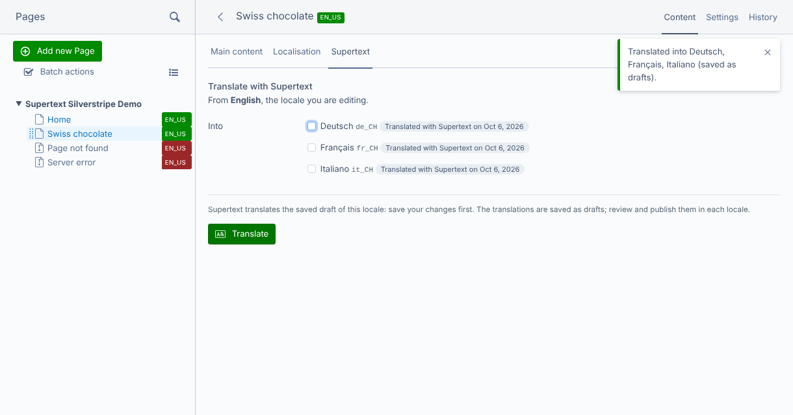
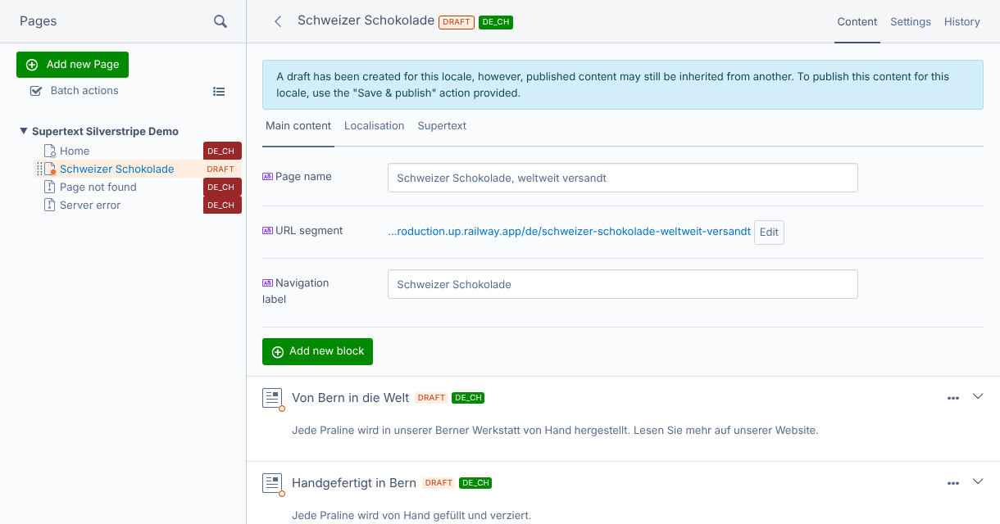
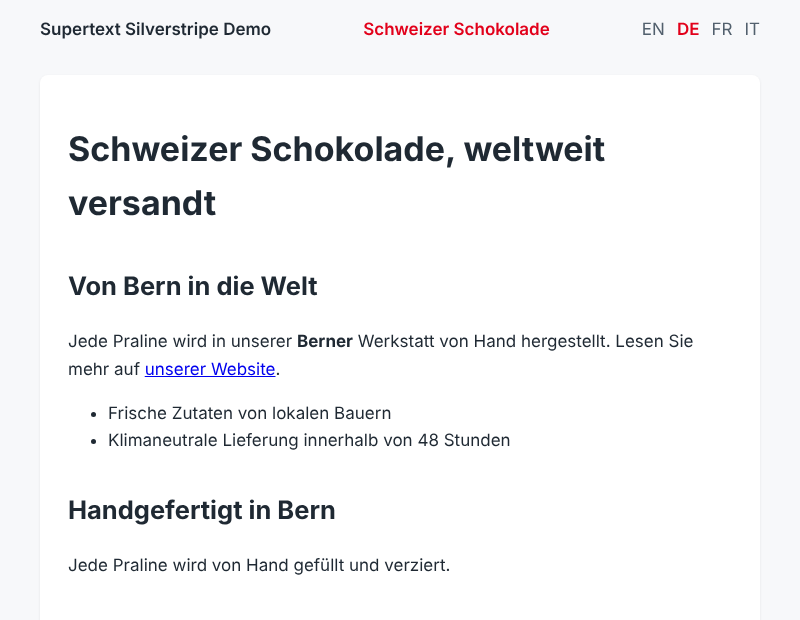
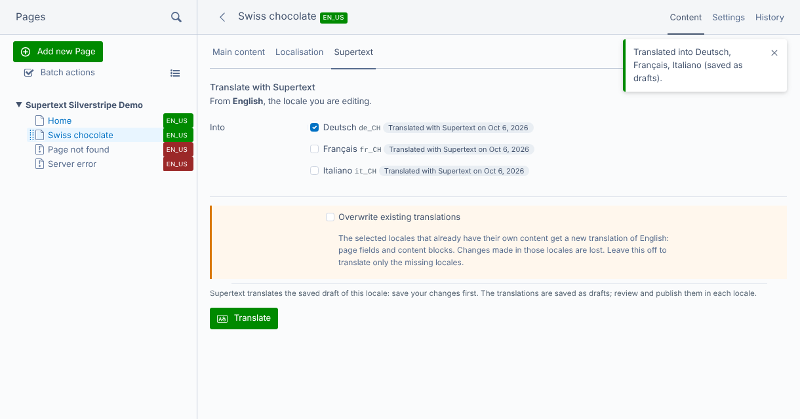

# User guide — Supertext Translation for Silverstripe

For editors who translate pages in the Silverstripe CMS. Your administrator has installed the module and set up the locales (see the [installation guide](INSTALLATION.md)).

## Translate a page

1. In **Pages**, choose the locale you translate **from** with the locale switcher at the top of the CMS menu (usually English), and open the page.
2. Save your changes first. Supertext translates the saved draft.
3. Open the **Supertext** tab.
4. Under **Into**, tick the locales to create. Locales where the page doesn't exist yet are ticked.
5. Click **Translate**.

Each locale takes a few seconds. A message then reports the result, and each locale shows **Translated with Supertext on** *date*:

## Review and publish

Switch to the locale (locale switcher) and open the page. The translation is a **draft** in that locale: the page name, navigation label, meta description, URL segment and all content blocks are translated, and formatting such as bold text, links and lists stays in place.

Change what you like, as if you had translated by hand, then **Publish**. Until you publish, visitors still see the content Fluent shows for that locale (usually the English fallback).

## Translate again or update a translation

Locales the page already exists in show **Already translated** or **Translated with Supertext on** *date*, and are not ticked. If you tick one, the tab shows an extra option:

- Leave **Overwrite existing translations** off: those locales are skipped (*Already translated, skipped*); only missing locales are created. Your edits are safe.
- Turn it on: the page fields and content blocks of those locales get a new translation of the locale you are in. **Changes made in those locales are lost.** The URL segment of an existing locale stays as it is. The result is again a draft; the published version stays online until you publish.

You can translate from any locale the page has its own content in, e.g. from German into French, by switching to that locale first.

## What is translated

| Content | What happens |
| --- | --- |
| Page name, navigation label, meta description | Translated |
| URL segment | Made from the translated page name when a locale is created; kept when overwriting |
| Content (HTML editor) | Translated as HTML: headings, bold, italic, links and lists stay in place, link addresses are kept |
| Content blocks (Elemental) | Their titles and texts are translated, if blocks are localised (ask your administrator) |
| Other text fields of the page type | Translated if they are localised, unless your administrator excluded them |
| Images, files, settings (e.g. who can view the page) | Not translated |

Empty fields are skipped.

## The translation log

**Supertext** in the CMS menu lists every translation: page, locales, result, who started it and when.

## Messages

| Message | Meaning |
| --- | --- |
| *Supertext is not set up yet: …* | No API key on the server. Ask your administrator. |
| *Already translated, skipped: …* | Those locales exist and *Overwrite existing translations* was off. |
| *This page has no content of its own in … yet* | Switch to a locale the page was written in. |
| *You are not allowed to edit this page in …* | You may not edit that locale. Ask your administrator. |
| *Choose at least one locale to translate into.* | Tick at least one locale under *Into*. |
| *Authentication failed. Please check the Supertext API key.* | The API key is wrong. Ask your administrator. |
| *Your Supertext translation limit is exceeded.* | Your organisation's Supertext limit is used up. |
| *Too many requests to Supertext. Please try again shortly.* | Supertext was busy; try again in a moment. |
| *Timed out waiting for the Supertext translation.* / *The Supertext service is currently unavailable.* | Supertext took too long or is unavailable. Try again later. |

Errors are reported per locale: if one locale fails, the others are still translated.
